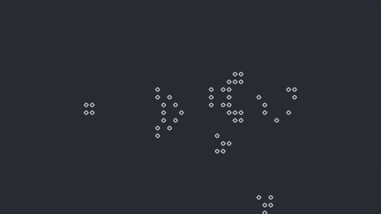

Small-scale Game of Life implementation in Zig that runs directly in the terminal and uses keyboard input for controls. Simply build and run with `zig build run`.

  
  

# Features
- Copy/paste regions of cells
- Fill/toggle regions of cells
- Wraps around border of screen

# Controls
Key(s) | Function
-------|---------
←↑↓→   | Move cursor
w      | Step time
p      | Pause/unpause simulation
t      | Toggle cell under cursor
R      | Fill screen with random cells
D      | Clear screen
space  | Start selection
t      | Toggle cells in selection
f      | Fill selection
d      | Clear region in selection
c      | Copy region in selection
x      | Cut region in selection
v      | Paste region
o      | Swap selection corners
q      | Cancel selection
=      | Rerender screen
Q      | Quit
